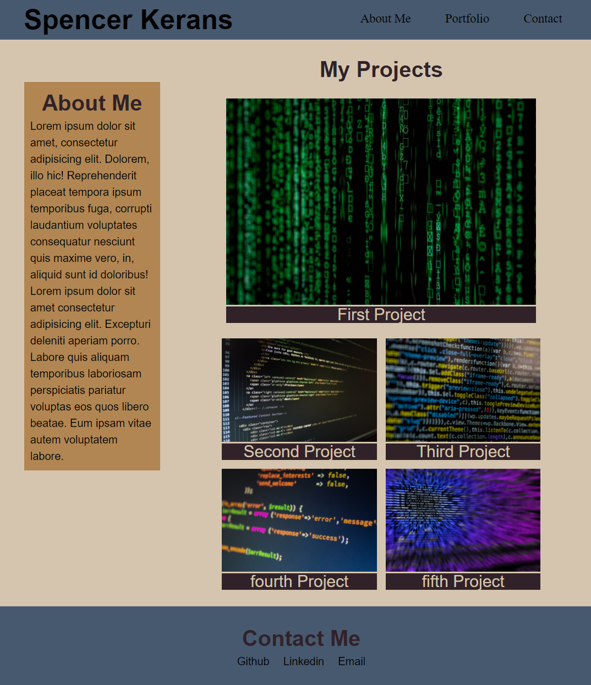

# My-Portfolio
My personal work portfolio

# Description
The main goal was to create a reactive portfolio page using HTML/CSS.

Filled in with lorem ipsum and placeholding images in place of personal information/picture and projects.

Can be found at
https://skerans.github.io/My-Portfolio/

# Sources
I used google fonts for my fonts
https://fonts.google.com/
For ideas on color schemes I used
http://paperheartdesign.com/blog/color-palette-vintage-vibes

As a web developer, I want to show my projects in a streamlined way, that highlights my 
